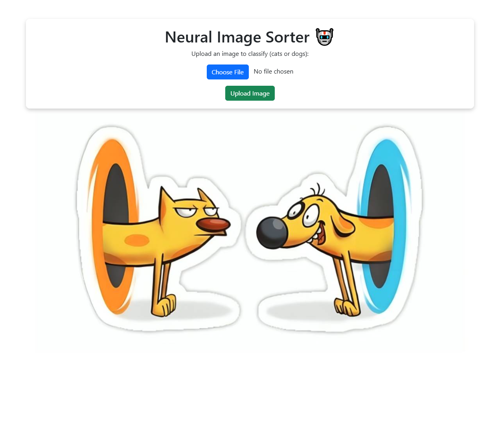
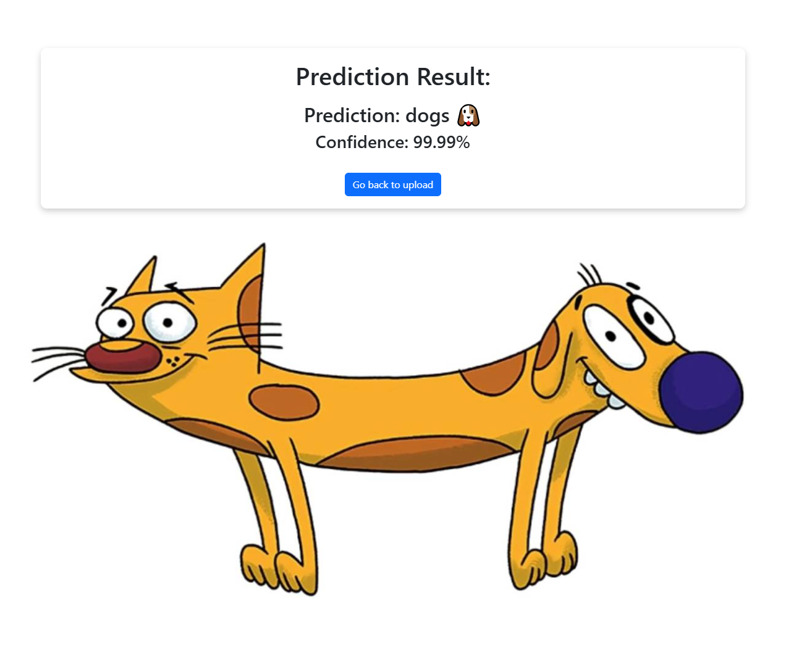

# Neural Image Sorter


## Description
Neural Image Sorter is an AI-powered web app that classifies images with deep learning, featuring a simple upload and prediction interface. 🖼️🤖


## Technologies Used
- Python
- Kaggle
- Tensorflow
- Flask


## Features
- Classify images (e.g., cats, dogs).
- Upload and get instant predictions.
- Simple and user-friendly interface.


## Setup
To install the project locally on your computer, execute the following commands in a terminal:
```bash
git clone https://github.com/Illya-Maznitskiy/neural-image-sorter.git
cd neural-image-sorter
python -m venv venv
venv\Scripts\activate (on Windows)
source venv/bin/activate (on macOS)
pip install -r requirements.txt
```


## Download a dataset
1. Download the dataset manually from Kaggle:
[kaggle_cat_and_dog](https://www.kaggle.com/datasets/tongpython/cat-and-dog)

2. Extract the dataset so that the folder structure looks like this:
```
neural-image-sorter/
├── backend/
│   ├── dataset/
│   │   ├── cats/
│   │   ├── dogs/
```


## Preprocess data
Run the preprocess script to resize the images for the machine learning model:
```bash
cd backend
python preprocess.py
```


## Teach the machine
Run the [train_model.ipynb](backend/model_training/train_model.ipynb) notebook to train your model.


## Run the local server
Use the following commands to start the server:
```bash
cd backend
python app.py
```


# Screenshots:

### Home Page


### Result page



## License
This project is licensed under the Apache License - see the [LICENSE](LICENSE) file for details.
